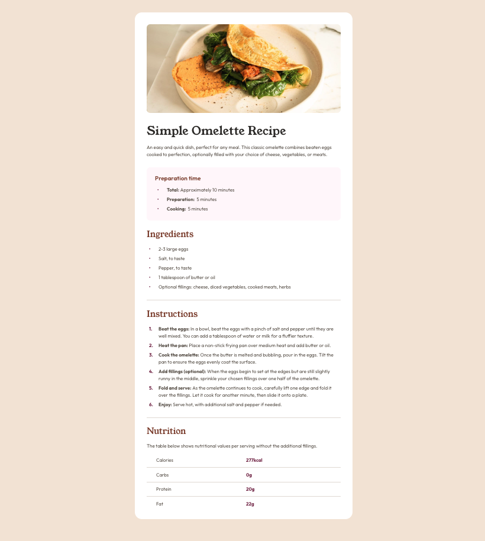

# Frontend Mentor - Recipe page solution

This is a solution to the [Recipe page challenge on Frontend Mentor](https://www.frontendmentor.io/challenges/recipe-page-KiTsR8QQKm). Frontend Mentor challenges help you improve your coding skills by building realistic projects. 

## Table of contents

- [Overview](#overview)
  - [The challenge](#the-challenge)
  - [Screenshot](#screenshot)
  - [Links](#links)
- [My process](#my-process)
  - [Built with](#built-with)
  - [What I learned](#what-i-learned)
  - [Continued development](#continued-development)
  - [Useful resources](#useful-resources)
- [Author](#author)

## Overview

### Screenshot



**Note: Delete this note and the paragraphs above when you add your screenshot. If you prefer not to add a screenshot, feel free to remove this entire section.**

### Links

- Solution URL: [Add solution URL here](https://your-solution-url.com)
- Live Site URL: [https://hchao7.github.io/recipe-page-main/]

## My process

### Built with

- Semantic HTML5 markup
- Flexbox
- BEM

### What I learned

This was my first time learning about CSS counters, which are essentially variables that have their values incremented by CSS rules that tracking the number of times they are used.  I used a counter to create custom numbered bullets.

```css
/* Create counter in the class selector for the parent element */
.component__list--numbers {
  counter-reset: my-counter;
}

/* Increment the counter for each child element */
.component__list-item--numbers {
  counter-increment: my-counter;
}

/* Insert value of counter */
.component__list-item--numbers::before {
  content: counter(my-counter) "."; 
}
```
I also applied BEM much more strictly compared to previous projects. For example, I noticed that all the sections (Title Section, Ingredients, Instructions, etc.) were variations of the same basic style. So I created a block to represent this basic entity, called ‘component’, and then added modifiers if I needed change its appearance. 

```css
/* Preparation section */
<section class="component component--smaller component--pink component--rounded">  
   /* Child elements */
</section
```

### Continued development

This was my first experience working with media queries, and I am excited about creating more projects with responsive design. For this project, I had to restyle parts of the desktop layout so the styles would change correctly for the mobile design. Therefore, I want to improve my initial planning process for the desktop layout so I have an easier time writing media queries for the mobile layout.

### Useful resources

- [Custom CSS Reset](https://www.joshwcomeau.com/css/custom-css-reset/) - This helped me reset the browser default styles.

## Author

- Frontend Mentor - [@hchao7](https://www.frontendmentor.io/profile/hchao7)

